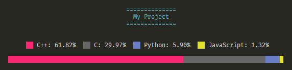

# Linguist256

Linguist256 is designed to produce a similar output to GitHub [Linguist](https://github.com/github/linguist) within a terminal window, provided the terminal has `xterm 256 (8bit) color` support.



## Install

Local environment installation with [`pipsi`](https://pypi.org/project/pipsi/)

```shell
git clone https://github.com/stillwwater/linguist256
pipsi install linguist256
```

## Usage

First, define a `languages.yml` file for your projects root directory ([example](languages.yml)), or use the complete `languages.yml` from [Linguist](https://github.com/github/linguist/blob/master/lib/linguist/languages.yml).

```shell
python3 -m linguist256 .
```

Multiple paths:

```shell
python3 -m linguist256 'first/path,second/path'
```

Only search languages of specific types:

 `-t | --types`

```shell
python3 -m linguist256 . --types 'programming,markup'
```

Change graph width (columns):

`-w | --width`

```shell
python3 -m linguist256 . --width 90
```

View more available options and help doc:

`-h | --help`

```shell
python3 -m linguist256 --help
```

---

*Note:* Linguist256 is mostly just a proof of concept and it's not as accurate as GitHub Linguist.
For this reason it is best to use your own `languages.yml` to avoid misclassified files.
